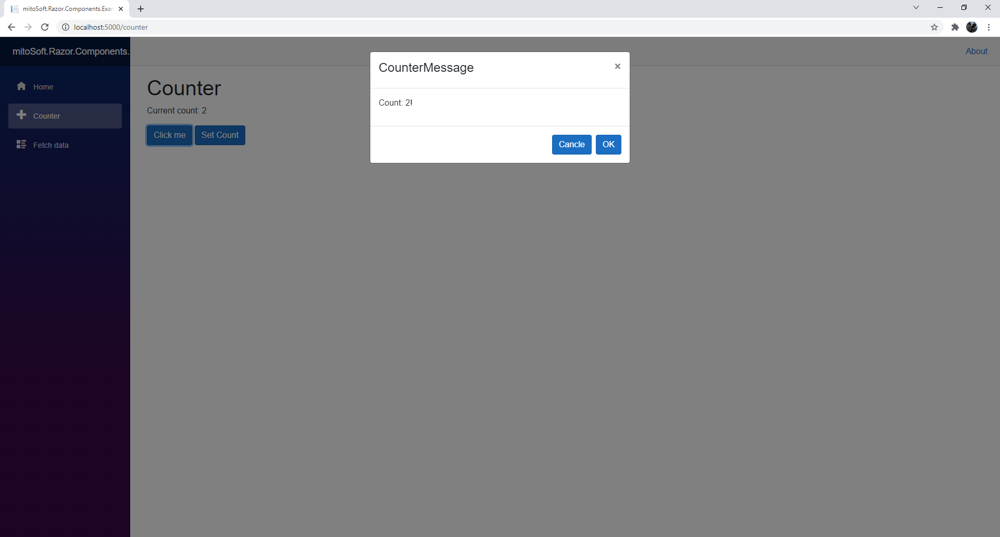
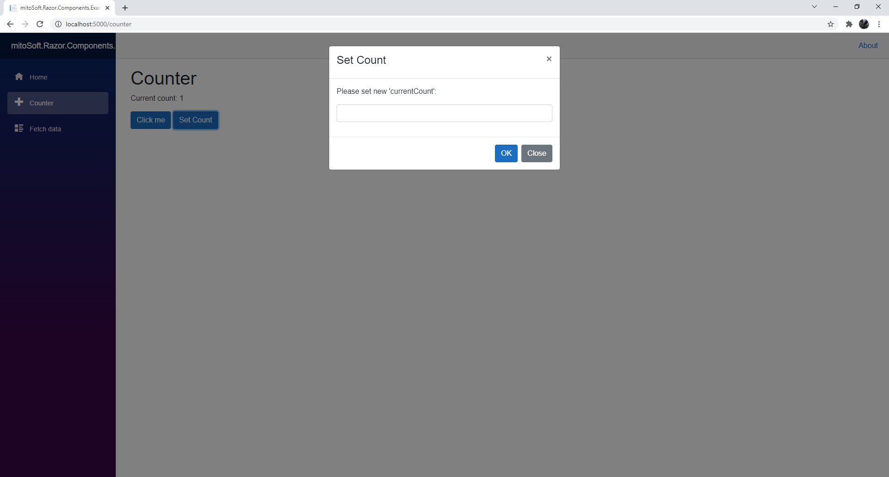

# mitoSoft.Razor.Components
Library contains standard interaction Modals for Blazor Apps.

It comes with a InputBox as well as a MessageBox which are similar to use as the old Forms boxes.

An exampe usage is given in the section below.

## Dependencies

 - Microsoft.AspNetCore.Components.Web (5.0.12)

## Example usage

MessageBox usage in a razor component.

```c#
  
  <MessageBox @ref=@_messageBox></MessageBox>
  
  @code {
	...
	
	this._messageBox.Show("CounterMessage", $"Count: {currentCount}!", Enums.DialogButtons.OK);
  
	...
```

More examples are provided in the [ExampleProject](mitoSoft.Razor.Components.Example).

## Look and Feel

The examples afterwards shows the boxes in a Blazor App that uses Bootstrap v4.3.1.

### MessageBox



### InputBox


